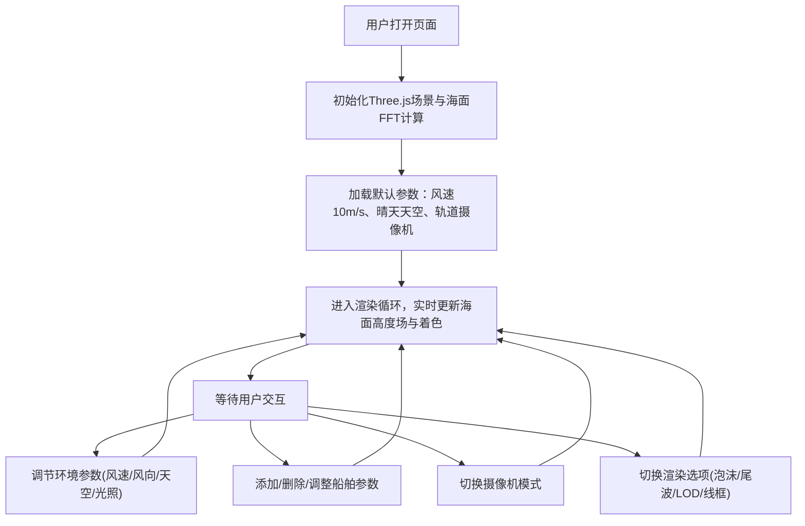

## 1. 产品概述

浏览器内的WebGL实时海洋水面渲染与船舶尾波模拟工具，面向计算机图形学爱好者、游戏开发者和视觉效果设计师，提供高保真的海面渲染与船舶航行动力学可视化。用户可实时调节风速、风向、光照等环境参数观察海面变化，并在海面上放置船舶观察Kelvin尾波效果。

## 2. 核心功能

### 2.1 功能模块

1. **海面渲染主视图**：FFT实时海面、PBR水体着色、天空环境反射
2. **环境参数控制**：风速/风向调节、天空预设切换、太阳方位/仰角、HDR曝光与色调映射
3. **船舶与尾波系统**：多船管理(1-3艘)、位置/速度/方向设定、Kelvin尾波、泡沫粒子轨迹
4. **渲染优化**：多层LOD网格、视锥裁剪、Mipmap法线、帧率/三角面数显示
5. **摄像机控制**：轨道模式(旋转/缩放/平移)、第一人称模式(WASD+鼠标)、一键切换

### 2.2 页面详情

| 页面名称 | 模块名称 | 功能描述 |
|----------|----------|----------|
| 主页 | 3D海面视口 | 全屏WebGL渲染区域，显示实时海面、船舶、天空盒，鼠标拖拽/滚轮控制摄像机 |
| 主页 | 右侧参数面板 | 固定悬浮面板，分组展示环境参数、船舶参数、渲染参数，所有控件实时响应 |
| 主页 | 性能HUD | 右下角显示FPS帧率、三角面数统计信息 |
| 主页 | 摄像机切换按钮 | 左上角切换轨道/第一人称摄像机模式 |

## 3. 核心流程

用户打开页面后，默认呈现45度俯瞰视角的平静海面。通过右侧面板调节风速风向可立即看到海面波浪变化；点击添加船舶按钮后可在参数区设置船舶位置与速度，海面随即出现V形Kelvin尾波；切换天空预设可体验不同时段光照效果；支持导出当前参数配置。

## 4. 用户界面设计

### 4.1 设计风格

- **主色调**：深海蓝 `#0a1628` 作为背景，海沫白 `#e8f4f8` 高亮，琥珀橙 `#f59e0b` 强调交互
- **按钮风格**：玻璃拟态(Glassmorphism)半透明卡片，圆角 8px，微弱内发光
- **字体**：标题使用 "Orbitron" 科技感等宽字体，正文使用 "Inter" 无衬线字体
- **布局风格**：右侧悬浮参数面板(宽度 320px)，全屏视口 + 分层UI覆盖
- **图标风格**：lucide-react 线性图标，统一 18px 尺寸

### 4.2 页面设计概述

| 页面名称 | 模块名称 | UI元素 |
|----------|----------|--------|
| 主页 | 3D海面视口 | 全屏WebGL Canvas，无额外装饰，鼠标悬浮隐藏光标 |
| 主页 | 右侧参数面板 | 深色玻璃拟态背景(backdrop-blur)，分组折叠(Accordion)，滑块带实时数值显示，旋钮采用SVG环形控制 |
| 主页 | 性能HUD | 右下角半透明黑底，等宽字体显示 FPS 和 Triangles，绿/黄/红三色指示性能状态 |
| 主页 | 摄像机切换按钮 | 左上角胶囊形按钮组，当前模式高亮琥珀色边框 |

### 4.3 响应式

桌面端优先设计，最小宽度 1280px。移动端降级为单列布局，参数面板改为底部抽屉式。

### 4.4 3D场景指引

- **环境**：程序生成HDR天空贴图，支持晴天/多云/日落三种预设，太阳方向实时联动
- **光照**：单方向平行光模拟太阳光，附带半球光提供环境补光，强度随太阳仰角变化
- **摄像机**：轨道模式默认距离 150 单位、俯仰角 45°，第一人称默认海面高度 5 单位、移动速度 20 单位/秒
- **构图**：海平面位于屏幕中下 1/3 处，默认船舶放置在原点附近形成视觉焦点
- **交互**：左键拖拽旋转视角，滚轮缩放，右键平移(轨道模式)；WASD移动，鼠标朝向(第一人称模式)
- **后期**：ACES/Reinhard 色调映射 + 可选FXAA抗锯齿，曝光值可调
- **资源**：天空盒使用Canvas程序化生成，泡沫噪声纹理程序化生成，所有Shader内联在代码中无外部资源依赖
