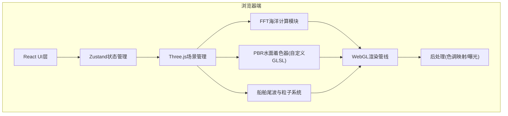

## 1. 架构设计



## 2. 技术描述

- **前端框架**: React@18 + TypeScript@5 + Vite@5
- **3D渲染**: three@0.160.x，原生Three.js API直接调用，不使用R3F以最大化Shader控制
- **状态管理**: zustand@4，集中管理环境参数、船舶参数、渲染参数、摄像机状态
- **样式方案**: TailwindCSS@3 + CSS Modules，UI组件使用玻璃拟态风格
- **数学运算**: 自定义FFT实现(Cooley-Tukey算法)，GLSL中完成主要计算
- **FFT计算方案**: GPU计算优先，使用WebGL浮点纹理实现Ping-Pong FFT；CPU回退用于非浮点纹理支持的环境
- **着色器方案**: 自定义ShaderMaterial，顶点Shader完成FFT高度场位移+Choppy Waves+Kelvin尾波叠加，片元Shader完成PBR水体着色

## 3. 目录结构与模块定义

```
src/
├── ocean/                    # 海洋渲染核心模块
│   ├── OceanFFT.ts           # FFT频谱计算(IFFT、Phillips谱生成、位移场)
│   ├── OceanMaterial.ts      # 水面ShaderMaterial定义(顶点/片元GLSL)
│   ├── OceanMesh.ts          # LOD网格管理、视锥裁剪
│   ├── Ship.ts               # 船舶对象与Kelvin尾波计算
│   ├── FoamSystem.ts         # 泡沫粒子与材质系统
│   └── SkyGenerator.ts       # 程序化HDR天空盒生成
├── camera/
│   ├── OrbitCamera.ts        # 轨道摄像机控制
│   └── FirstPersonCamera.ts  # 第一人称摄像机控制
├── components/               # React UI组件
│   ├── ControlPanel.tsx      # 右侧参数面板主容器
│   ├── EnvironmentGroup.tsx  # 环境参数组(风速/风向/天空/光照)
│   ├── ShipGroup.tsx         # 船舶参数组(添加/删除/位置/速度)
│   ├── RenderGroup.tsx       # 渲染参数组(泡沫/尾波/LOD/线框)
│   ├── Slider.tsx            # 自定义滑块组件
│   ├── Knob.tsx              # 风向旋钮组件
│   └── StatsHUD.tsx          # FPS/三角面数HUD
├── store/
│   └── useAppStore.ts        # Zustand全局状态
├── shaders/
│   ├── ocean.vert.glsl       # 海面顶点Shader(FFT位移+尾波)
│   ├── ocean.frag.glsl       # 海面片元Shader(PBR水体)
│   ├── sky.vert.glsl
│   ├── sky.frag.glsl
│   └── foam.frag.glsl
├── utils/
│   ├── math.ts               # 数学工具(GPUFFT辅助)
│   └── color.ts              # 颜色空间转换
├── App.tsx                   # 主应用组件
├── main.tsx                  # 入口
└── index.css                 # 全局样式(Tailwind)
```

## 4. 核心数据结构

### 4.1 环境参数
```typescript
interface EnvironmentParams {
  windSpeed: number;       // 风速 1-30 m/s
  windDirection: number;   // 风向 0-360 度
  skyPreset: 'clear' | 'cloudy' | 'sunset';
  sunAzimuth: number;      // 太阳方位角 0-360
  sunElevation: number;    // 太阳仰角 0-90
  exposure: number;        // 曝光值 -2 到 +2
  toneMapping: 'reinhard' | 'aces';
}
```

### 4.2 船舶参数
```typescript
interface ShipParams {
  id: string;
  position: { x: number; z: number };  // XZ平面位置
  speed: number;          // 船速 0-20 m/s
  heading: number;        // 航向角 0-360
  wakeEnabled: boolean;
}
```

### 4.3 渲染参数
```typescript
interface RenderParams {
  foamEnabled: boolean;
  wakeEnabled: boolean;
  lodLevel: 'auto' | 'high' | 'medium' | 'low';
  wireframe: boolean;
  cameraMode: 'orbit' | 'firstPerson';
}
```

## 5. 关键算法

### 5.1 FFT海面生成
- **频谱网格**: 256x256 复数值，Phillips谱: `P_h(k) = A * exp(-1/(kL)²) * |k·w|² / k⁴`，其中`L = V²/g`
- **逆FFT**: GPU双Pass使用蝴蝶算法，Ping-Pong浮点纹理，每帧更新相位因子 `exp(i·k·c·t)`
- **Choppy Waves**: 从频谱求导得到水平位移 `Dx/Dz = -i * kx/k² * H(k) * exp(ikx+ikz)`
- **Jacobian检测**: `J = (1+∂Dx/∂x)(1+∂Dz/∂z) - (∂Dx/∂z)(∂Dz/∂x)`，J < 0 标记为波峰破碎

### 5.2 Kelvin尾波
- **V形角度**: 固定半角19.47°(sin⁻¹(1/3))
- **波幅计算**: `A(r,θ) ∝ speed² / sqrt(r) * f(θ)`，其中横波与散波叠加
- **波长**: `λ = 2π·V²/(g·cos²(θ/2))`，速度越快波长越长
- **叠加方式**: 在顶点Shader中根据世界坐标计算每艘船对当前顶点的尾波高度贡献，叠加到FFT高度场

### 5.3 PBR水体着色
- **菲涅耳(Schlick)**: `F = F₀ + (1-F₀)·(1-cosθ)⁵`，水F₀=0.02
- **反射**: 采样天空盒CubeMap，根据法线反射方向采样
- **折射**: `color = deepColor * exp(-k·depth)`，depth为水下深度
- **散射**: 当视线接近光照方向且处于波峰薄区时叠加 `vec3(0.1, 0.4, 0.3)` 散射色
- **高光GGX**: `D = α² / (π·((n·h)²·(α²-1)+1)²)`，α = 0.15

### 5.4 LOD策略
- 三层LOD: 256²(近0-200)、128²(中200-800)、64²(远800+)
- 网格块划分: 海面划分为8x8块，每块独立判断视锥可见性
- 过渡方式: 距离混合避免LOD切换跳变，法线使用硬件Mipmap

## 6. 性能指标

- 目标帧率: 60 FPS (RTX 2060同级GPU)
- 三角面数: ~50K-200K (视LOD距离动态变化)
- 内存占用: < 200MB (主要为FFT浮点纹理、天空盒、粒子缓冲区)
- 单次渲染Pass: 海面1Pass + 天空盒1Pass + 粒子1Pass + 后处理1Pass
